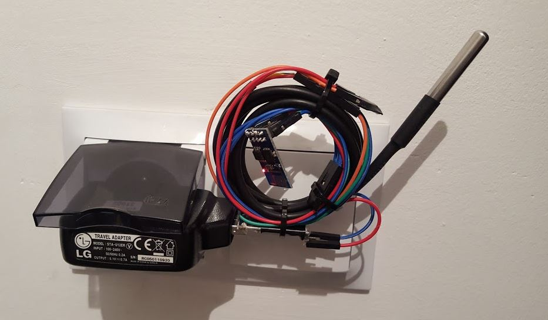

# temperatures2cloud-nodemcu

This NodeMCU-Lua script works on ESP8266. 
It periodically reads temperatures from DS18B20 (1-Wire) sensors and sends values directly to ThingSpeak channel.

  
## Run
* adapt [settings.lua](settings.lua) to your environment and needs
* create [keys.lua](keys.lua) according to [keys-example.lua](keys-example.lua) file with your own api key
* finally invoke manually dofile("temp2cloud.lua") or add it to your init.lua script

## Technology stack
* IoT
* esp82660
* nodemcu
* lua
* 1-wire
* DS18B20

